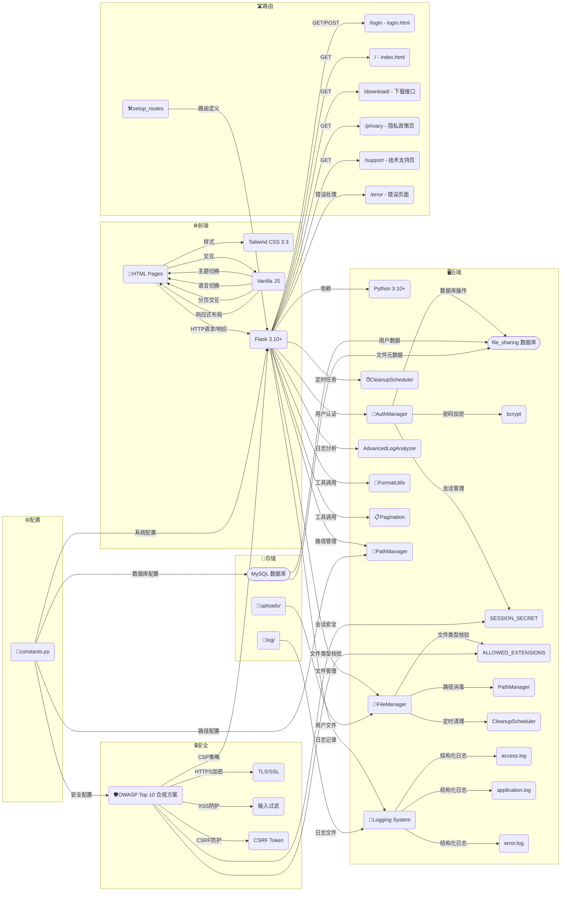
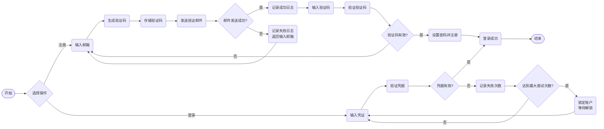

<div align="center">
    <h1>Peak Cloud Share - 安全高效的文件共享平台</h1>
    <p>
        
        
        
        
        
    </p>
</div>

> **Peak Cloud Share** 是一个功能强大的**文件共享**平台，旨在提供安全、高效的文件共享服务。<br>
> 支持**多用户认证**、**文件管理**、**主题和语言切换**等功能，同时具备详细的**日志记录**和**分析**功能，帮助管理员监控和优化系统性能。

## 💻 技术栈

| **分类**     | **技术/工具**                                    | **📌 关键描述**                                                                                                                                                                                                                        |
|------------|----------------------------------------------|------------------------------------------------------------------------------------------------------------------------------------------------------------------------------------------------------------------------------------|
| 🌶️ **后端** | `Flask 3.10+`<br>`Python 3.10+`              | • 轻量级WSGI框架，支持异步视图与蓝图模块化开发<br>• 集成Werkzeug安全组件，实现请求解析与路由匹配<br>• 基于`auth.py`的原子化认证机制，支持密码强度校验与账户锁定策略                                                                                                                                |
| 🌐 **前端**  | `Tailwind CSS 3.3`<br>`Vanilla JS`           | • Utility-First CSS框架，实现响应式布局与暗黑模式适配<br>• 原生JS实现多语言动态切换（中英文）、文件列表分页加载及开发者工具禁用等安全防护功能                                                                                                                                               |
| 🗄️ **存储** | `MySQL`<br>`文件系统`                            | • **用户数据**：通过`DB_CONFIG`配置MySQL数据库（默认库`file_sharing`），存储用户信息、验证码及登录状态<br>• **文件存储**：用户上传文件按`username/YYYY-MM-DD`目录结构存储于`uploads/`，支持最大10GB单文件存储<br>• **日志存储**：三类日志（访问/应用/错误）分别存储于`log/`目录，按日归档便于审计                                 |
| 🔒 **安全**  | `OWASP Top 10` 合规方案<br>`bcrypt`<br>`TLS/SSL` | • **认证安全**：使用`bcrypt`进行密码哈希（盐值动态生成），实施3次失败锁定策略（锁定5分钟）<br>• **文件安全**：`file_manager.py`实现高危文件检测（13类黑名单）+ 扩展名白名单校验（9类）<br>• **通信安全**：通过`SSL_CERT`/`SSL_KEY`启用HTTPS，邮件发送使用SMTP_SSL加密传输<br>• **会话安全**：动态生成24字节`SESSION_SECRET`，禁止会话固定攻击 |
| 📊 **日志**  | `Python logging`<br>`log_analysis.py`        | • 三级日志分类（INFO/WARNING/ERROR），记录请求IP、用户操作、响应时间等元数据<br>• 支持日志结构化解析，通过`AdvancedLogAnalyzer`生成登录失败统计、文件操作频率等可视化报告                                                                                                                      |

## ✨ 核心功能

### 🔐 安全体系（增强版）

- **动态密钥认证**
    - 基于`AuthManager`实现原子化认证：用户名严格校验（4-20位字母开头）、密码强度检测（8-32位混合字符）
    - 登录保护：连续3次失败自动锁定账户（锁定时长5分钟），锁定期间返回模糊错误信息防止枚举攻击
    - 验证码机制：注册/重置时生成6位数字验证码（5分钟有效期），通过`EmailSender`发送带品牌视觉的HTML邮件（背景色#111827，SSL加密传输）

- **文件安全防护**
    - **高危文件隔离**：实时检测`exe/bat/sh/dll/js/vbs/apk`等13类高危扩展名，上传时直接阻断并记录安全日志
    - **路径消毒**：通过`sanitize_filename`过滤目录遍历字符（`../`/`./`），标准化路径为正斜杠，防止目录穿越攻击
    - **类型校验**：白名单校验与MIME类型双重验证，确保上传文件合法性

- **会话与传输安全**
    - 会话密钥`SESSION_SECRET`由`os.urandom(24)`动态生成，服务重启自动更新，防止会话劫持
    - 全站强制HTTPS（通过`SSL_FOLDER`配置证书），实施CSP策略限制脚本来源，XSS防护通过输入转义实现

### 📂 文件管理（企业级）

- **大文件支持**
    - 单文件最大10GB（通过`MAX_CONTENT_LENGTH`配置），文件夹总大小限制10GB
    - 存储结构：`uploads/用户名/日期/消毒后文件名`，自动创建多级目录并记录文件元数据（大小/修改时间）

- **智能生命周期管理**
    - **定时清理**：通过`CleanupScheduler`执行每日任务，删除超过365天未访问的文件（可通过`FILE_RETENTION`配置）
    - **空间监控**：上传前校验文件夹总大小，超额时抛出明确错误（如“文件夹总大小超过10GB限制”）

- **高效查询与交互**
    - 分页文件列表：默认每页20条，支持按“最后修改时间”降序排序，返回包含总页数、文件总数的结构化数据
    - 前端交互：通过`scripts.js`实现无刷新分页加载，支持键盘翻页与响应式布局适配

### 📝 日志系统（全链路审计）

- **三级日志分类**
    - **访问日志**：记录请求方法、路径、客户端IP、响应状态码（如`POST /upload 200`）
    - **应用日志**：追踪文件操作（上传/下载/删除）、用户登录状态变更等关键事件
    - **错误日志**：捕获500级异常，包含堆栈跟踪与请求上下文（如`用户xxx文件保存失败: OSError`）

- **日志分析能力**
    - 通过`log_analysis.py`解析日志数据，生成：
        - 登录失败热力图（按时间段统计失败次数）
        - 文件类型分布报表（高频上传文件类型排行）
        - 异常请求TOP10（按错误码分组统计）
    - 支持导出CSV/JSON格式，为安全审计与性能优化提供数据支撑

### 📧 邮件服务（企业级通知）

- **验证码邮件**：
    - 模板化HTML邮件，包含品牌LOGO、渐变背景（#2563eb到#1d4ed8）、安全提示区块（红色背景突出显示）
    - 发送流程：生成验证码→存储到`verification_codes`表→通过`SMTP_SSL`加密传输→记录发送日志（成功/失败详情）
    - 防滥用：同一邮箱5分钟内限发3次验证码，防止短信轰炸攻击

[//]: # (架构图前面的图标)

### 📊 **系统架构图**



### 🔑 用户登录及注册流程图



## 📁 项目结构

```plaintext
peak-cloud-share-master/
├── certs/                             # TLS证书存储目录
│   ├── server.crt                     # X.509证书文件
│   └── server.key                     # 私钥文件
├── config/                            # 全局配置文件目录
│   └── constants.py                   # 应用级配置常量定义
├── core/                              # 核心业务逻辑模块
│   ├── auth.py                        # 认证授权子系统
│   ├── email_sender.py                # SMTP邮件服务模块
│   ├── file_manager.py                # 文件存储管理抽象层
│   ├── log_analysis.py                # 结构化日志处理组件
│   ├── path_manager.py                # 文件路径解析器
│   ├── scheduler.py                   # 后台任务调度器
│   └── utils.py                       # 通用工具函数库
├── docs/                              # 项目文档目录
├── logs/                              # 运行时日志存储
│   ├── access.log                     # HTTP请求访问日志
│   ├── application.log                # 应用业务日志
│   └── error.log                      # 异常堆栈日志
├── mapper/                            # 数据映射层
│   └── db.py                          # ORM数据映射层
├── uploads/                           # 用户文件持久化存储目录（需设置ACL）
│   └── [username]/                    # 按用户隔离的存储空间
├── web/                               # 前端工程化目录
│   ├── assets/                        # 编译后静态资源
│   │   ├── css/                       # CSS样式表
│   │   ├── img/                       # 静态图像资源
│   │   ├── js/                        # 客户端脚本
│   │   └── webfonts/                  # Web字体资源
│   └── *.html                         # 前端页面模板
├── .gitignore                         # 版本控制忽略规则
├── app.py                             # WSGI应用入口（Flask实例）
├── LICENSE                            # 开源协议声明
├── README.md                          # 项目文档
├── requirements.txt                   # Python依赖清单
└── setup.py                           # 包分发配置
```

## 🛠️ 快速部署

### 环境要求

- Python 3.9+
- pip 23.0+
- 存储空间：建议 50GB+（根据实际需求调整）

### 配置指南

- **关键配置项（constants.py）**：

```python
# 安全配置
MAX_ATTEMPTS = ？  # 最大登录尝试次数
LOCK_DURATION = ？  # 账户锁定时长（秒）
SESSION_SECRET = ？.urandom(24)  # 动态会话密钥

# 存储配置
MAX_CONTENT_LENGTH = ？  # 10GB单文件限制
FILE_RETENTION = ？  # 文件保留周期

# 清理任务
CLEANUP_INTERVAL = ？  # 每日执行清理任务
```

- **路径说明（path_manager.py）**：

| **目录类型** | **默认路径**        | **功能描述**         |
|----------|-----------------|------------------|
| **上传目录** | `/uploads`      | 用户加密存储空间         |
| **审计日志** | `/log`          | 按日归档的 JSON 格式日志  |
| **用户数据** | `/mapper/db.py` | 加密存储的账户凭证        |
| **前端资源** | `/web`          | HTML/CSS/JS 静态文件 |

- **核心模块**：

| **模块**            | **功能描述**       | **依赖关系**          |
|-------------------|----------------|-------------------|
| `auth.py`         | 用户认证/账户锁定/审计日志 | `constants.py`    |
| `email_sender.py` | SMTP邮件服务       | `constants.py`    |
| `log_analysis.py` | 结构化日志处理        | `constants.py`    |
| `path_manager.py` | 文件路径解析器        | `constants.py`    |
| `file_manager.py` | 文件上传/消毒/分页查询   | `path_manager.py` |
| `scheduler.py`    | 定时清理任务/资源监控    | `path_manager.py` |
| `utils.py`        | 数据格式化/智能分页生成   | 无                 |

### 开发步骤

```bash
# 克隆仓库
git clone https://github.com/dcyyd/peak-cloud-share-master.git

# 安装依赖
pip install -r requirements.txt

# 初始化目录结构
python -c "from core.path_manager import PathManager; PathManager.initialize()"

# 启动服务
python app.py

# 访问登录页面
http://localhost:5000/login

# 默认账户
username: A000281
password: A0002811
```

### 打包发布

**cx_Freeze 工具打包**：

```bash
# 安装依赖
pip install cx_Freeze

# 打包命令
python.exe .\setup.py build

# 打包后文件
build\exe.win-amd64-3.7\PeakCloudShare.exe

# 运行命令
start .\build\exe.win-amd64-3.7\PeakCloudShare.exe
```

## 法律声明

- **版权声明**：&copy; 2025-2026 [D.C.Y.](https://dcyyd.github.io) | v2.0.0 | PeakCloud Internal System

- **许可协议**：
  本项目遵循 [MIT License](LICENSE)。您可以在遵守以下条件的情况下使用、修改和分发本项目：
    - 保留原始版权声明和许可协议。
    - 本项目不得用于任何非法或侵权行为。
    - 本项目不得用于任何商业用途，除非获得明确书面许可。

- **免责声明**：
    - 本项目按“原样”提供，不提供任何形式的明示或暗示的保证。
    - 在任何情况下，开发者或维护者不对因使用本项目而产生的任何直接、间接、附带或后果性损害负责。

## 联系我们

如果您有任何问题、建议或合作意向，请通过以下方式联系我们：

- **GitHub 仓库**：[https://github.com/dcyyd/peak-cloud-share-master](https://github.com/dcyyd/peak-cloud-share-master)
- **电子邮件**：[dcyyd_kcug@yeah.net](mailto:dcyyd_kcug@yeah.net)
- **个人主页**：[https://dcyyd.github.io](https://dcyyd.github.io)